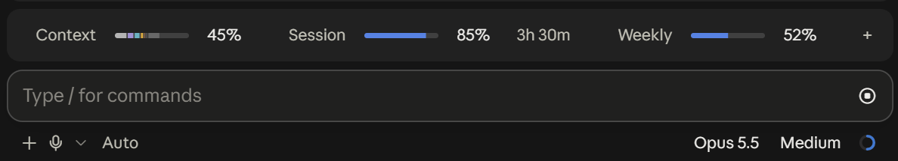
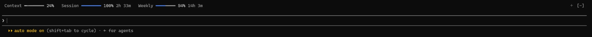
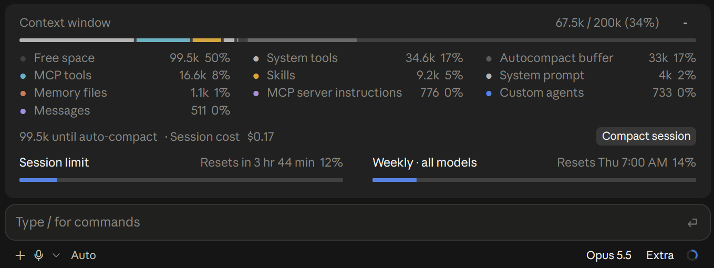
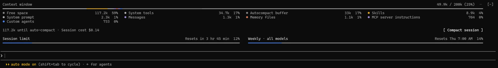

<div align="center">

# usage-band

**Context window and plan limits, always in view, in a band above the Claude Code prompt.**

[](https://github.com/benpaternostro/claude-usage-band/releases/latest)
[](LICENSE)
[](https://docs.anthropic.com/en/docs/claude-code)
[](#install)
[](#where-it-works)
[](https://github.com/benpaternostro/claude-usage-band/commits/main)

<sub>Unofficial. This project is not affiliated with or endorsed by Anthropic. Claude is a trademark of Anthropic.</sub>

<br>



<sub>Desktop Code tab</sub>



<sub>Terminal</sub>

</div>

## Features

| Meter | Shows |
| --- | --- |
| **Context** | How full the context window is, coloured by category as `/context` shows it |
| **Session** | The 5-hour plan limit, with the time until it resets |
| **Weekly** | The 7-day plan limit, with the time until it resets |
| **Credits** | The spend limit, when your plan has one |
| **Cache** | Estimated prompt-cache time remaining, to the left of the `＋` toggle |

The cache countdown updates each second after a main-conversation response uses or writes the cache. `~` marks an estimate. The countdown uses your cache TTL settings. Without an explicit setting, it estimates the TTL from the plan limits. `Cache —` means no cache time is available. A model switch or compaction clears the estimate. See [Claude Code cache lifetimes](https://code.claude.com/docs/en/prompt-caching#cache-lifetime).

Click a meter or the `＋` toggle to open the **drawer**. It shows the full context breakdown, the space left before auto-compact, the session cost, and a **Compact session** button.

The context breakdown is a local estimate. It sends no API request.

<details open>
<summary><b>The drawer</b></summary>
<br>





</details>

## Quick start

In a Claude Code session, run:

```
/plugin install usage-band --marketplace benpaternostro/claude-usage-band
```

Confirm the marketplace source, choose an installation scope, and start a new session.

## Where it works

| Surface | Status |
| --- | --- |
| Terminal, including the VS Code integrated terminal | ✅ Supported. The bars are drawn as text. Click a meter's label or figures, or `＋`, to open the drawer. |
| Desktop app, Code tab | ✅ Supported |
| VS Code extension | ❌ Not supported. The extension loads the mod and runs its hooks, but it draws no plugin UI: neither the band nor a status line. Tested on extension 2.1.291. |

## Requirements

- Claude Code 2.1.275 or later. The mod was tested on 2.1.288.
- The terminal or the desktop Code tab.

> [!WARNING]
> The function-hook plugin API is in early access. It can change between Claude Code releases without notice.

## Install

### From the marketplace

From your shell, the install is two commands:

```bash
claude plugin marketplace add benpaternostro/claude-usage-band
```

```bash
claude plugin install usage-band@claude-usage-band
```

To get a new version, run:

```bash
claude plugin update usage-band@claude-usage-band
```

### Try it for one session

Clone the repository, then start Claude Code with the folder:

```bash
git clone https://github.com/benpaternostro/claude-usage-band.git
```

```bash
claude --plugin-dir ./claude-usage-band
```

### Load it from a folder in every session

Use this method when you change the mod yourself, or in the desktop app, where you cannot give a command-line flag. Add the absolute path of the cloned folder to the `env` block of `~/.claude/settings.json`:

```json
{
  "env": {
    "CLAUDE_CODE_PLUGIN_DIRS": "/Users/you/code/claude-usage-band"
  }
}
```

To load more than one folder, separate the paths with `:` on macOS and Linux, or with `;` on Windows.

> [!IMPORTANT]
> Do not load the mod from a folder and also install it from the marketplace. Use one method only.

Claude Code writes the API type declarations into `.claude-plugin/types/` when it loads the mod from a folder. These files are not in the repository.

## Develop

```bash
claude plugin validate .
```

```bash
claude plugin test .
```

When you load the mod from a folder, it reloads in a running terminal session after you save `hooks/register.tsx`. In the desktop app, set `CLAUDE_CODE_PLUGIN_DIR_WATCH=1` in the same `env` block to get this behaviour, or start a new session.

### Layout

| Path | Contents |
| --- | --- |
| `hooks/register.tsx` | The hooks: usage refresh, band and drawer rendering |
| `.claude-plugin/marketplace.json` | The marketplace entry for `/plugin install` |
| `types/index.d.ts` | Snapshot types and plugin state declarations |
| `tests/band.test.ts` | Helper and render tests |

## License

[MIT](LICENSE)
